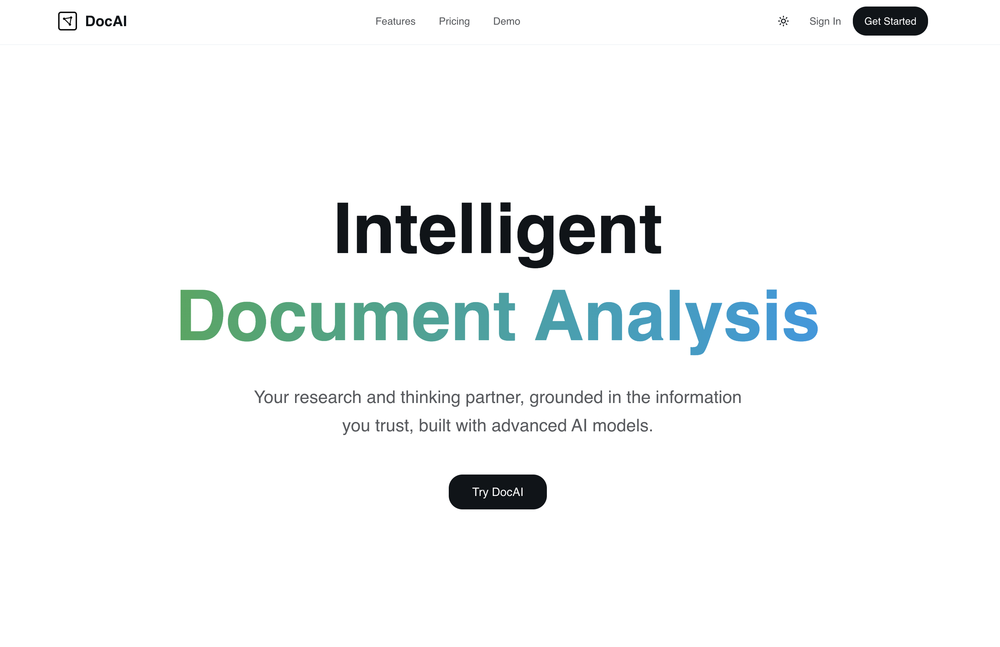

# DocAI - Intelligent Document Analysis Platform

[](https://docai-analysis-platform.vercel.app/)

**Live Demo:** [https://docai-analysis-platform.vercel.app/](https://docai-analysis-platform.vercel.app/)

> An AI-powered document analysis platform that processes 100-page PDFs in under 30 seconds and answers questions with 90%+ accuracy using advanced RAG (Retrieval-Augmented Generation) technology.

## ✨ Features

- **Multi-Format Support** - Process PDFs, DOCX, Excel files, and scanned documents with OCR
- **AI-Powered Q&A** - Ask questions and get instant answers powered by GPT-4, Claude, and Gemini
- **Lightning Fast** - Optimized RAG pipeline processes documents in seconds
- **Multi-Model AI** - Intelligent model selection with automatic fallback for reliability
- **Advanced Analytics** - Extract entities, analyze sentiment, and visualize insights
- **Secure & Private** - End-to-end encryption with secure cloud storage

## 🚀 Tech Stack

- **Frontend:** Next.js 16, React, TypeScript, Tailwind CSS, shadcn/ui
- **Backend:** Next.js API Routes, Drizzle ORM
- **AI/ML:** LangChain, OpenAI, Anthropic Claude, Google Gemini
- **Storage:** AWS S3, Pinecone Vector Database
- **Auth:** Better Auth
- **Document Processing:** PDF.js, Mammoth (DOCX), SheetJS (Excel)

## 📦 Installation

1. **Clone the repository**

```bash
git clone https://github.com/anjola-adeuyi/docai-analysis-platform.git
cd docai-analysis-platform
```

1. **Install dependencies**

```bash
npm install
```

1. **Set up environment variables**

Create a `.env.local` file in the root directory with the following variables:

```env
# Database
DATABASE_URL=

# Auth
BETTER_AUTH_SECRET=
BETTER_AUTH_URL=

# AI Models
OPENAI_API_KEY=
ANTHROPIC_API_KEY=
GOOGLE_GENERATIVE_AI_API_KEY=

# Storage
AWS_REGION=
AWS_ACCESS_KEY_ID=
AWS_SECRET_ACCESS_KEY=
AWS_S3_BUCKET_NAME=

# Vector Database
PINECONE_API_KEY=
PINECONE_INDEX_NAME=
```

1. **Run the development server**

```bash
npm run dev
```

Open [http://localhost:3000](http://localhost:3000) to see the application.

## 🏗️ Project Structure

```text
├── app/                    # Next.js app directory
│   ├── (auth)/            # Authentication pages
│   ├── (dashboard)/       # Dashboard pages
│   └── api/               # API routes
├── components/            # React components
│   ├── auth/             # Authentication components
│   ├── dashboard/        # Dashboard components
│   ├── document/         # Document viewer & uploader
│   └── ui/               # shadcn/ui components
├── lib/                   # Core libraries
│   ├── ai/               # AI & RAG pipeline
│   ├── db/               # Database schema
│   ├── processors/       # Document processors
│   └── vector/           # Vector database
└── public/               # Static assets
```

## 🔑 Key Features

### RAG Pipeline

Advanced retrieval-augmented generation with:

- Intelligent document chunking
- Vector embeddings with Pinecone
- Multi-model query processing
- Context-aware responses

### Document Processing

- **PDF:** Extract text, images, and metadata
- **DOCX:** Parse Word documents with formatting
- **Excel:** Process spreadsheets and data tables
- **OCR:** Handle scanned documents

### AI Integration

- **OpenAI GPT-4:** General-purpose reasoning
- **Anthropic Claude:** Long-context analysis
- **Google Gemini:** Multimodal understanding
- **Intelligent Fallback:** Automatic model switching for reliability

## 📝 License

MIT License - feel free to use this project for personal or commercial purposes.

## 👨‍💻 Author

Built by [Anjola Adeuyi](https://www.anjolaadeuyi.com/) - Senior Full-Stack + AI Engineer

---

**Star ⭐ this repo if you find it useful!**
